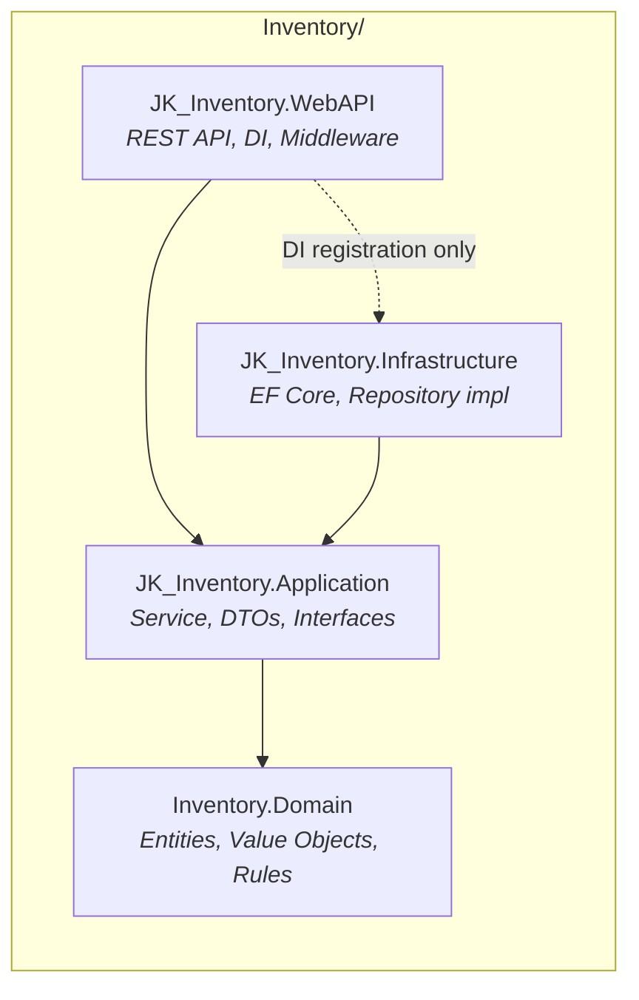
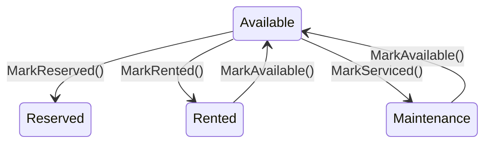

# Vehicle Inventory Microservice

PROG3176 Assignment 1

## Architecture Overview

Vehicle Inventory Microservice built with **Clean Architecture** and **Domain-Driven Design (DDD)**. Dependencies point inward - outer layers depend on inner layers, never the reverse.



| Layer | Project | Depends On |
|-------|---------|------------|
| Domain | `Inventory.Domain` | None |
| Application | `JK_Inventory.Application` | Domain |
| Infrastructure | `JK_Inventory.Infrastructure` | Application, Domain |
| WebAPI | `JK_Inventory.WebAPI` | Application, Infrastructure* |

\* Infrastructure reference is only for DI registration (Composition Root), not architectural dependency.

## Explanation of Clean Architecture layers

### Domain (`Inventory.Domain`)

The innermost layer. Contains business rules and has **zero external dependencies** (no EF Core, no ASP.NET).

- `Common/`
  - `Entity` - Base class providing `Id` property for all entities
  - `IAggregateRoot` - Marker interface identifying which entities can have repositories
  - `ValueObject` - Base class with value-based equality (`GetEqualityComponents()`)
- `Entities/`
  - `Vehicle` - Aggregate Root. Encapsulates status transition rules (e.g., a rented vehicle cannot be sent to maintenance)
- `ValueObjects/`
  - `VehicleCode` - Wraps Make + Model strings. Validates non-null/empty at creation
  - `LocationId` - Wraps location FK int. Rejects values ≤ 0 at creation
  - `VehicleTypeId` - Wraps vehicle type FK int. Rejects values ≤ 0 at creation
- `Enums/`
  - `VehicleStatus` - Available, Reserved, Rented, Maintenance
- `Exceptions/`
  - `InvalidVehicleStateException` - Thrown when a status transition violates business rules

### Application (`JK_Inventory.Application`)

Defines **what the system can do** through interfaces and orchestrates use cases. References only Domain.

- `Interfaces/`
  - `IRepository<T>` - Generic CRUD interface with `where T : Entity, IAggregateRoot` constraint
  - `IVehicleRepository` - Extends `IRepository<Vehicle>`. Currently empty (common CRUD is sufficient)
  - `IVehicleService` - Use case contract (CreateVehicle, UpdateVehicleStatus, GetById, GetAll, Delete)
- `DTOs/`
  - `JK_CreateVehicleDto` - Make, Model, LocationId, VehicleTypeId
  - `JK_UpdateVehicleStatusDto` - NewStatus
  - `JK_VehicleDto` - Full vehicle representation for API responses
- `Services/`
  - `JK_VehicleService` - Implements `IVehicleService`. Converts DTOs ↔ Domain entities, calls Repository

### Infrastructure (`JK_Inventory.Infrastructure`)

Implements Application interfaces with **concrete technology** (EF Core + SQL Server).

- `Persistence/`
  - `JK_InventoryDbContext` - EF Core DbContext (DB-first scaffolded from SQL Server)
  - `Entities/` - EF entity classes (`JkInventory`, `JkVehicle`, `JkVehicleType`, `JkVehicleStatus`, `JkVehicleLocation`)
- `Repositories/`
  - `JK_VehicleRepository` - Implements `IVehicleRepository`. Maps between DB entities (JkInventory + JkVehicle) and Domain entity (Vehicle)

### WebAPI (`JK_Inventory.WebAPI`)

Entry point. Exposes REST endpoints and serves as the **Composition Root** (DI wiring).

- `Controllers/`
  - `JK_VehiclesController` - 5 REST endpoints (GET all, GET by id, POST, PUT status, DELETE)
- `Middleware/`
  - `JK_ExceptionMiddleware` - Catches domain exceptions and maps to HTTP status codes (404, 400, 500)
- `Program.cs` - DI registration (`AddDbContext`, `AddScoped` for Repository and Service) + Swagger configuration

## Domain Model and Business Rules

### Vehicle (Aggregate Root)

The `Vehicle` entity combines two database tables (`JK_Vehicle` + `JK_Inventory`) into a single domain object.

| Property | Type | Description |
|----------|------|-------------|
| Id | `int` | Unique identifier (from `Entity` base) |
| VehicleCode | `VehicleCode` | Make + Model |
| LocationId | `LocationId` | Vehicle location FK |
| VehicleTypeId | `VehicleTypeId` | Vehicle type FK |
| Status | `VehicleStatus` | Current status |

### Status Transition Rules



Blocked transitions (throw `InvalidVehicleStateException`):

- **Reserved → Available** - Must be explicitly released, cannot directly revert
- **Reserved → Rented** - A reserved vehicle cannot be rented
- **Rented → Rented** - Already rented
- **Rented → Maintenance** - Must be returned first

### Value Object Validation

Value Objects reject invalid input at **creation time**, before it enters the domain:

| Value Object | Rule | Example |
|-------------|------|---------|
| `VehicleCode` | Make and Model must be non-null and non-empty | `new VehicleCode("", "Camry")` → `ArgumentException` |
| `LocationId` | Must be > 0 | `new LocationId(0)` → `ArgumentException` |
| `VehicleTypeId` | Must be > 0 | `new VehicleTypeId(-1)` → `ArgumentException` |

### Generic Repository Constraint

```csharp
public interface IRepository<T> where T : Entity, IAggregateRoot
```

Only classes that implement both `Entity` and `IAggregateRoot` can be used as a repository target. This enforces the DDD rule - **only Aggregate Roots have Repositories** - at compile time.

## Run Instructions

### Prerequisites

- .NET 10 SDK
- SQL Server (LocalDB or full instance)

### 1. Create the Database

Run the included SQL script in SQL Server Management Studio (SSMS) or `sqlcmd`:

```
Inventory/JK_Inventory.Infrastructure/Scripts/JK_VehicleInventoryDb.sql
```

This script creates the `JK_VehicleInventoryDb` database with all 5 tables (`JK_Vehicle`, `JK_VehicleType`, `JK_VehicleStatus`, `JK_VehicleLocation`, `JK_Inventory`) using the assignment naming convention (`JK_` prefix), along with seed data.

### 2. Run the WebAPI

```bash
dotnet run --project Inventory/JK_Inventory.WebAPI
```

All dependencies (DbContext, Repository, Service) are registered via DI in `Program.cs` — no additional configuration needed.

### 3. Open Swagger UI

Navigate to `https://localhost:7253/swagger` to test endpoints.

## Known Limitations

- **No clear service requirements for CRUD** - The API was built without a detailed specification (e.g., what POST should return). Currently, `POST /api/JK_Vehicles` returns `200 Ok()` instead of `201 Created` with the created resource, because the expected response contract was not defined.
- **No containerization** - Not deployed with Docker or Kubernetes. The service runs locally and is not production-ready from a deployment perspective.
- **No inter-service communication** - The Inventory service operates in isolation. It is not integrated with the other services in the solution (Customer.WebAPI, Maintenance.WebAPI) — no synchronous calls or async messaging between them.
- **VehicleCode validation is minimal** - `VehicleCode` only checks non-null/empty for Make and Model. There is no validation against allowed values (e.g., a list of known manufacturers). If there were a mechanism to define or look up permitted Make/Model combinations, the Value Object could enforce stronger domain invariants.
- **Permissive status transitions beyond assignment rules** - The domain only blocks the four transitions explicitly required by the assignment. Other transitions like Reserved → Maintenance, Maintenance → Maintenance, and Available → Available are technically allowed by the current implementation. A production system would likely enforce stricter transition rules.
